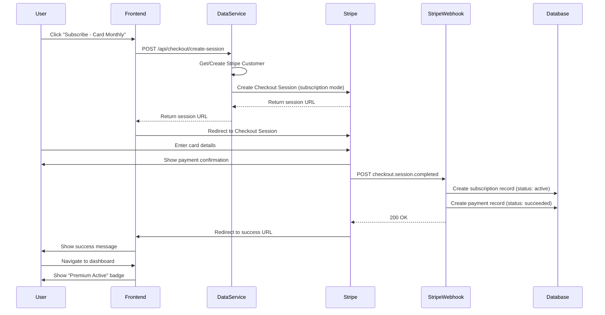
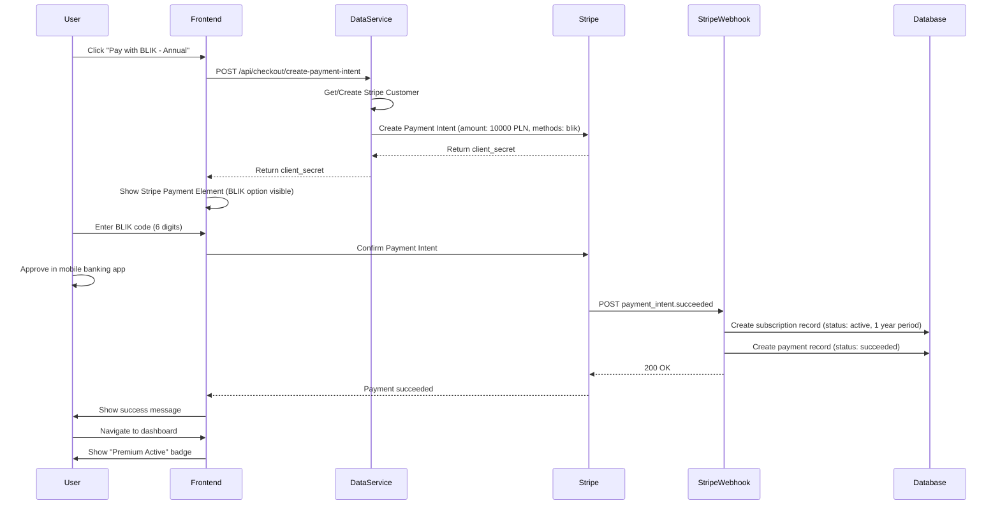

# Payment System Design Document - Waste Collection Notification App

**Version:** 1.0
**Date:** 2026-01-09
**Status:** Ready for Implementation
**Author:** System Architecture Team

---

## Executive Summary

This document specifies the complete implementation of a payment system for the powiadomienia.info waste collection notification app. The system enables monetization through two payment methods optimized for the Polish market:

1. **Card Subscription** - PLN 10/month (recurring via Stripe)
2. **BLIK Annual Payment** - PLN 100/year (one-time payment, saves PLN 20 vs monthly)

**Key Strategy:** Promote annual BLIK payment to collect larger amounts upfront and avoid BLIK recurring payment limitations in Stripe.

**Core Business Logic:** Only users with active paid subscriptions receive SMS notifications. Free users can view waste schedules but cannot receive SMS.

**Technical Approach:** Integrate Stripe for payment processing, implement webhook-driven subscription management, gate SMS sending via subscription status checks in the existing Cloudflare Cron notification system.

**Key Business Decisions:**
- Hard cutoff on expiry (no grace period)
- No refunds for BLIK annual payments
- 1 subscription covers all user addresses
- Email notifications: payment success + 7-day expiry warning
- Free users see full schedule (2 weeks)
- Manual subscription upgrades (no proration)
- Stripe invoices (no custom Polish VAT)
- Admin via Stripe Dashboard (no custom UI in v1)

---

## 1. Context & Background

### Current System Architecture

**Monorepo Structure:**
- `apps/user-application/` - TanStack Start frontend (React 19, deployed to Cloudflare Workers)
- `apps/data-service/` - Hono backend (WorkerEntrypoint, deployed to Cloudflare Workers)
- `packages/data-ops/` - Shared package (Drizzle schemas, queries, auth)

**Database:** Neon Postgres via Drizzle ORM

**Auth:** Better Auth with email/password and Google OAuth

**Existing User Flow:**
1. User registers → `auth_user` created
2. User adds phone → `auth_user.phone` updated (Polish format +48)
3. User adds address → `addresses` table + auto-creates 2 `notification_preferences` (19:00 day before, 07:00 same day)
4. Cloudflare Cron runs hourly → queries `getUsersNeedingNotification()` → sends SMS via SerwerSMS API
5. Dashboard shows phone form, address form, waste schedule card

**SMS Provider:** SerwerSMS (Polish SMS gateway)
- Cost: ~0.03-0.04 PLN per SMS (ECO mode)
- Trigger: Cloudflare Cron hourly (`scheduled/index.ts`)
- Queue: Cloudflare Queues (`NOTIFICATION_QUEUE`)

**Current Dashboard:** `/app` route (`apps/user-application/src/routes/_auth/app/index.tsx`)
- Shows setup status badge (complete/incomplete)
- Phone form card
- Addresses card
- Waste schedule card (only if phone + address added)

### Why This Payment System

**Problem:** SMS costs accumulate. Without monetization, the service is unsustainable.

**Solution:** Freemium model
- Free: View waste schedule only
- Paid: Receive SMS notifications

**Polish Market Context:**
- BLIK is extremely popular (mobile banking instant payment)
- BLIK in Stripe: one-time payments only, no recurring subscriptions
- Card payments: support recurring subscriptions
- Strategy: Promote annual BLIK to avoid recurring payment issues and improve cash flow

---

## 2. Goals & Non-Goals

### Goals

1. **Implement Stripe Integration**
   - Sandbox testing before production
   - Card monthly subscriptions (PLN 10/month)
   - BLIK annual payments (PLN 100/year)

2. **Gate SMS Notifications**
   - Only send SMS to users with active paid subscriptions
   - Modify existing `getUsersNeedingNotification()` query

3. **Provide User Feedback**
   - Paid users see "Premium Active" badge
   - Free users see "Free Plan - View Only" with upgrade CTA
   - Dashboard shows subscription status clearly

4. **Webhook-Driven Subscription Management**
   - Handle payment success/failure events
   - Handle subscription lifecycle (created, updated, cancelled, expired)
   - Create/update subscription records in database

5. **Support Multiple Environments**
   - Dev, Stage, Prod with separate Stripe keys
   - Webhook endpoints per environment

### Non-Goals

1. **No subscription cancellation UI** (in v1 - users email support)
2. **No invoice management** (Stripe handles this)
3. **No custom billing portal** (use Stripe Customer Portal later if needed)
4. **No proration logic** (simple: card = recurring, BLIK = 1 year fixed)
5. **No free trial period** (users can see schedule for free, that's the trial)

---

## 3. Database Schema Changes

### 3.1 New Tables

#### `subscription_plans` Table

Defines available subscription plans.

```sql
CREATE TABLE subscription_plans (
  id SERIAL PRIMARY KEY,
  name TEXT NOT NULL,                    -- "Card Monthly", "BLIK Annual"
  stripe_product_id TEXT NOT NULL UNIQUE,-- Stripe Product ID
  stripe_price_id TEXT NOT NULL UNIQUE,  -- Stripe Price ID
  currency TEXT NOT NULL DEFAULT 'PLN',
  amount INTEGER NOT NULL,               -- Amount in grosze (1000 = 10.00 PLN)
  interval TEXT NOT NULL,                -- "month", "year"
  interval_count INTEGER NOT NULL DEFAULT 1,
  is_active BOOLEAN NOT NULL DEFAULT true,
  payment_method TEXT NOT NULL,          -- "card", "blik"
  description TEXT,
  created_at TIMESTAMP NOT NULL DEFAULT NOW(),
  updated_at TIMESTAMP NOT NULL DEFAULT NOW()
);

CREATE INDEX subscription_plans_stripe_product_id_idx ON subscription_plans(stripe_product_id);
CREATE INDEX subscription_plans_stripe_price_id_idx ON subscription_plans(stripe_price_id);
```

**Initial Data:**
```sql
INSERT INTO subscription_plans (name, stripe_product_id, stripe_price_id, currency, amount, interval, interval_count, payment_method, description) VALUES
('Card Monthly', 'prod_xxx_card_monthly', 'price_xxx_card_monthly', 'PLN', 1000, 'month', 1, 'card', 'Monthly subscription with card - PLN 10/month'),
('BLIK Annual', 'prod_xxx_blik_annual', 'price_xxx_blik_annual', 'PLN', 10000, 'year', 1, 'blik', 'Annual payment with BLIK - PLN 100/year (save 2 months)');
```

> **Note:** Replace `prod_xxx` and `price_xxx` with actual Stripe IDs after creating products in Stripe Dashboard.

---

#### `subscriptions` Table

Tracks user subscriptions.

```sql
CREATE TABLE subscriptions (
  id SERIAL PRIMARY KEY,
  user_id TEXT NOT NULL REFERENCES auth_user(id) ON DELETE CASCADE,
  subscription_plan_id INTEGER NOT NULL REFERENCES subscription_plans(id) ON DELETE RESTRICT,
  stripe_customer_id TEXT NOT NULL,      -- Stripe Customer ID
  stripe_subscription_id TEXT,           -- Stripe Subscription ID (NULL for BLIK one-time)
  stripe_payment_intent_id TEXT,         -- Stripe Payment Intent ID (for BLIK)
  status TEXT NOT NULL,                  -- "active", "past_due", "canceled", "expired"
  current_period_start TIMESTAMP NOT NULL,
  current_period_end TIMESTAMP NOT NULL,
  cancel_at_period_end BOOLEAN NOT NULL DEFAULT false,
  canceled_at TIMESTAMP,
  created_at TIMESTAMP NOT NULL DEFAULT NOW(),
  updated_at TIMESTAMP NOT NULL DEFAULT NOW()
);

CREATE INDEX subscriptions_user_id_idx ON subscriptions(user_id);
CREATE INDEX subscriptions_stripe_customer_id_idx ON subscriptions(stripe_customer_id);
CREATE INDEX subscriptions_stripe_subscription_id_idx ON subscriptions(stripe_subscription_id);
CREATE INDEX subscriptions_stripe_payment_intent_id_idx ON subscriptions(stripe_payment_intent_id);
CREATE INDEX subscriptions_status_idx ON subscriptions(status);
CREATE INDEX subscriptions_current_period_end_idx ON subscriptions(current_period_end);
```

**Status Values:**
- `active` - Subscription is active, user receives SMS
- `past_due` - Payment failed (card only), user does NOT receive SMS
- `canceled` - User canceled subscription, still active until `current_period_end`
- `expired` - Subscription expired, user does NOT receive SMS

---

#### `payments` Table

Logs all payment transactions.

```sql
CREATE TABLE payments (
  id SERIAL PRIMARY KEY,
  user_id TEXT NOT NULL REFERENCES auth_user(id) ON DELETE CASCADE,
  subscription_id INTEGER REFERENCES subscriptions(id) ON DELETE SET NULL,
  stripe_payment_intent_id TEXT NOT NULL UNIQUE, -- Stripe Payment Intent ID
  stripe_charge_id TEXT,                         -- Stripe Charge ID
  amount INTEGER NOT NULL,                       -- Amount in grosze
  currency TEXT NOT NULL DEFAULT 'PLN',
  status TEXT NOT NULL,                          -- "pending", "succeeded", "failed"
  payment_method TEXT NOT NULL,                  -- "card", "blik"
  failure_code TEXT,
  failure_message TEXT,
  receipt_url TEXT,
  paid_at TIMESTAMP,
  created_at TIMESTAMP NOT NULL DEFAULT NOW(),
  updated_at TIMESTAMP NOT NULL DEFAULT NOW()
);

CREATE INDEX payments_user_id_idx ON payments(user_id);
CREATE INDEX payments_subscription_id_idx ON payments(subscription_id);
CREATE INDEX payments_stripe_payment_intent_id_idx ON payments(stripe_payment_intent_id);
CREATE INDEX payments_status_idx ON payments(status);
CREATE INDEX payments_paid_at_idx ON payments(paid_at);
```

**Status Values:**
- `pending` - Payment initiated but not completed
- `succeeded` - Payment successful
- `failed` - Payment failed

---

### 3.2 Auth User Schema Extension

Add subscription-related fields to `auth_user` table:

```sql
ALTER TABLE auth_user
ADD COLUMN stripe_customer_id TEXT;

CREATE INDEX auth_user_stripe_customer_id_idx ON auth_user(stripe_customer_id);
```

This allows quick lookup of Stripe customer during checkout and webhook processing.

---

### 3.3 Drizzle Schema Implementation

**File:** `packages/data-ops/src/drizzle/schema.ts`

```typescript
import { pgTable, serial, text, timestamp, boolean, integer, index } from "drizzle-orm/pg-core"
import { auth_user } from "./auth-schema"

export const subscription_plans = pgTable("subscription_plans", {
  id: serial("id").primaryKey(),
  name: text("name").notNull(),
  stripeProductId: text("stripe_product_id").notNull().unique(),
  stripePriceId: text("stripe_price_id").notNull().unique(),
  currency: text("currency").notNull().default("PLN"),
  amount: integer("amount").notNull(),
  interval: text("interval").notNull(),
  intervalCount: integer("interval_count").notNull().default(1),
  isActive: boolean("is_active").notNull().default(true),
  paymentMethod: text("payment_method").notNull(),
  description: text("description"),
  createdAt: timestamp("created_at").defaultNow().notNull(),
  updatedAt: timestamp("updated_at").defaultNow().notNull().$onUpdate(() => new Date()),
}, (table) => [
  index("subscription_plans_stripe_product_id_idx").on(table.stripeProductId),
  index("subscription_plans_stripe_price_id_idx").on(table.stripePriceId),
]);

export const subscriptions = pgTable("subscriptions", {
  id: serial("id").primaryKey(),
  userId: text("user_id").notNull().references(() => auth_user.id, { onDelete: "cascade" }),
  subscriptionPlanId: integer("subscription_plan_id").notNull().references(() => subscription_plans.id, { onDelete: "restrict" }),
  stripeCustomerId: text("stripe_customer_id").notNull(),
  stripeSubscriptionId: text("stripe_subscription_id"),
  stripePaymentIntentId: text("stripe_payment_intent_id"),
  status: text("status").notNull(),
  currentPeriodStart: timestamp("current_period_start").notNull(),
  currentPeriodEnd: timestamp("current_period_end").notNull(),
  cancelAtPeriodEnd: boolean("cancel_at_period_end").notNull().default(false),
  canceledAt: timestamp("canceled_at"),
  createdAt: timestamp("created_at").defaultNow().notNull(),
  updatedAt: timestamp("updated_at").defaultNow().notNull().$onUpdate(() => new Date()),
}, (table) => [
  index("subscriptions_user_id_idx").on(table.userId),
  index("subscriptions_stripe_customer_id_idx").on(table.stripeCustomerId),
  index("subscriptions_stripe_subscription_id_idx").on(table.stripeSubscriptionId),
  index("subscriptions_stripe_payment_intent_id_idx").on(table.stripePaymentIntentId),
  index("subscriptions_status_idx").on(table.status),
  index("subscriptions_current_period_end_idx").on(table.currentPeriodEnd),
]);

export const payments = pgTable("payments", {
  id: serial("id").primaryKey(),
  userId: text("user_id").notNull().references(() => auth_user.id, { onDelete: "cascade" }),
  subscriptionId: integer("subscription_id").references(() => subscriptions.id, { onDelete: "set null" }),
  stripePaymentIntentId: text("stripe_payment_intent_id").notNull().unique(),
  stripeChargeId: text("stripe_charge_id"),
  amount: integer("amount").notNull(),
  currency: text("currency").notNull().default("PLN"),
  status: text("status").notNull(),
  paymentMethod: text("payment_method").notNull(),
  failureCode: text("failure_code"),
  failureMessage: text("failure_message"),
  receiptUrl: text("receipt_url"),
  paidAt: timestamp("paid_at"),
  createdAt: timestamp("created_at").defaultNow().notNull(),
  updatedAt: timestamp("updated_at").defaultNow().notNull().$onUpdate(() => new Date()),
}, (table) => [
  index("payments_user_id_idx").on(table.userId),
  index("payments_subscription_id_idx").on(table.subscriptionId),
  index("payments_stripe_payment_intent_id_idx").on(table.stripePaymentIntentId),
  index("payments_status_idx").on(table.status),
  index("payments_paid_at_idx").on(table.paidAt),
]);
```

**File:** `packages/data-ops/src/drizzle/auth-schema.ts` (addition)

```typescript
export const auth_user = pgTable("auth_user", {
  // ... existing fields
  stripeCustomerId: text("stripe_customer_id"),
  // ...
}, (table) => [
  // ... existing indexes
  index("auth_user_stripe_customer_id_idx").on(table.stripeCustomerId),
]);
```

---

### 3.4 Migration Strategy

**Step 1:** Generate migration
```bash
cd packages/data-ops
pnpm run drizzle:dev:generate
```

**Step 2:** Review generated SQL in `packages/data-ops/src/drizzle/migrations/dev/`

**Step 3:** Apply migration
```bash
pnpm run drizzle:dev:migrate
```

**Step 4:** Seed subscription plans (after Stripe setup)
```bash
pnpm run seed:dev
```

**Step 5:** Repeat for stage and prod environments
```bash
pnpm run drizzle:stage:generate
pnpm run drizzle:stage:migrate
pnpm run seed:stage

pnpm run drizzle:prod:generate
pnpm run drizzle:prod:migrate
pnpm run seed:prod
```

---

## 4. Stripe Integration Architecture

### 4.1 Stripe Products & Prices Setup

**Manual Setup in Stripe Dashboard (per environment: test mode, production mode):**

1. **Product 1: Card Monthly Subscription**
   - Name: `powiadomienia.info - Card Monthly`
   - Description: `Monthly subscription with automatic card payments - PLN 10/month`
   - Price:
     - Type: Recurring
     - Amount: PLN 10.00
     - Billing period: Monthly
     - Payment methods: Card
   - Save Product ID (`prod_xxx`) and Price ID (`price_xxx`)

2. **Product 2: BLIK Annual Payment**
   - Name: `powiadomienia.info - BLIK Annual`
   - Description: `Annual payment with BLIK - PLN 100/year (save PLN 20 vs monthly)`
   - Price:
     - Type: One-time
     - Amount: PLN 100.00
     - Payment methods: BLIK (configured via Payment Element)
   - Save Product ID (`prod_yyy`) and Price ID (`price_yyy`)

> **BLIK Note:** Stripe Payment Element auto-detects Polish locale and shows BLIK as payment option. No special setup needed beyond enabling BLIK in Stripe Dashboard → Settings → Payment methods.

---

### 4.2 Environment Variables

**Per-Environment Configuration:**

**File:** `apps/data-service/.dev.vars` (local development)
```bash
# Stripe Keys (Test Mode)
STRIPE_SECRET_KEY=sk_test_xxx
STRIPE_PUBLISHABLE_KEY=pk_test_xxx
STRIPE_WEBHOOK_SECRET=whsec_xxx

# Subscription Plan IDs (Test Mode)
STRIPE_CARD_MONTHLY_PRICE_ID=price_test_xxx
STRIPE_BLIK_ANNUAL_PRICE_ID=price_test_yyy
```

**File:** `apps/data-service/wrangler.jsonc` (stage/prod via Cloudflare secrets)
```jsonc
"env": {
  "stage": {
    "vars": {
      "STRIPE_PUBLISHABLE_KEY": "pk_test_xxx"
    }
    // Secrets set via: wrangler secret put STRIPE_SECRET_KEY --env stage
    // STRIPE_SECRET_KEY, STRIPE_WEBHOOK_SECRET set as secrets (not in wrangler.jsonc)
  },
  "prod": {
    "vars": {
      "STRIPE_PUBLISHABLE_KEY": "pk_live_xxx"
    }
    // Secrets set via: wrangler secret put STRIPE_SECRET_KEY --env prod
    // STRIPE_SECRET_KEY, STRIPE_WEBHOOK_SECRET set as secrets
  }
}
```

**File:** `apps/user-application/.env` (frontend needs publishable key)
```bash
VITE_STRIPE_PUBLISHABLE_KEY=pk_test_xxx
```

**File:** `apps/user-application/wrangler.jsonc`
```jsonc
"env": {
  "stage": {
    "vars": {
      "VITE_STRIPE_PUBLISHABLE_KEY": "pk_test_xxx"
    }
  },
  "prod": {
    "vars": {
      "VITE_STRIPE_PUBLISHABLE_KEY": "pk_live_xxx"
    }
  }
}
```

---

### 4.3 Stripe SDK Setup

**Install Stripe SDK:**
```bash
pnpm add stripe --filter data-service
pnpm add @stripe/stripe-js --filter user-application
```

**File:** `apps/data-service/src/stripe/client.ts`

```typescript
import Stripe from 'stripe';

let stripeClient: Stripe | null = null;

export function initStripe(secretKey: string): Stripe {
  if (!stripeClient) {
    stripeClient = new Stripe(secretKey, {
      apiVersion: '2024-12-18.acacia',
      typescript: true,
    });
  }
  return stripeClient;
}

export function getStripe(): Stripe {
  if (!stripeClient) {
    throw new Error('Stripe client not initialized');
  }
  return stripeClient;
}
```

**File:** `apps/data-service/src/index.ts` (initialize Stripe on worker start)

```typescript
import { WorkerEntrypoint } from "cloudflare:workers";
import { app } from "@/hono/app";
import { initDatabase } from "@repo/data-ops/database/setup";
import { initStripe } from "@/stripe/client";
import { handleScheduled } from "./scheduled";
import { handleQueue } from "./queues";

export default class DataService extends WorkerEntrypoint<Env> {
  constructor(ctx: ExecutionContext, env: Env) {
    super(ctx, env);
    initDatabase({
      host: env.DATABASE_HOST,
      username: env.DATABASE_USERNAME,
      password: env.DATABASE_PASSWORD,
    });
    initStripe(env.STRIPE_SECRET_KEY);
  }

  fetch(request: Request) {
    return app.fetch(request, this.env, this.ctx);
  }

  async scheduled(controller: ScheduledController) {
    await handleScheduled(controller, this.env, this.ctx);
  }

  async queue(batch: MessageBatch<NotificationMessage>) {
    await handleQueue(batch, this.env);
  }
}
```

---

### 4.4 Stripe Customer Creation

**File:** `packages/data-ops/src/queries/stripe-customer.ts`

```typescript
import { getDb } from "@/database/setup";
import { auth_user } from "@/drizzle/auth-schema";
import { eq } from "drizzle-orm";

export async function getOrCreateStripeCustomer(userId: string, email: string, name: string): Promise<string> {
  const db = getDb();

  const [user] = await db
    .select({ stripeCustomerId: auth_user.stripeCustomerId })
    .from(auth_user)
    .where(eq(auth_user.id, userId))
    .limit(1);

  if (user?.stripeCustomerId) {
    return user.stripeCustomerId;
  }

  // Stripe customer creation happens in data-service (has Stripe SDK)
  // This query will be called FROM data-service after customer creation
  throw new Error('Stripe customer not found - should be created in data-service');
}

export async function saveStripeCustomerId(userId: string, stripeCustomerId: string) {
  const db = getDb();

  await db
    .update(auth_user)
    .set({ stripeCustomerId, updatedAt: new Date() })
    .where(eq(auth_user.id, userId));
}
```

**File:** `apps/data-service/src/stripe/customer.ts`

```typescript
import { getStripe } from "./client";
import { saveStripeCustomerId } from "@repo/data-ops/queries/stripe-customer";

export async function getOrCreateStripeCustomer(
  userId: string,
  email: string,
  name: string,
  existingStripeCustomerId?: string | null
): Promise<string> {
  if (existingStripeCustomerId) {
    return existingStripeCustomerId;
  }

  const stripe = getStripe();

  const customer = await stripe.customers.create({
    email,
    name,
    metadata: {
      userId,
    },
  });

  await saveStripeCustomerId(userId, customer.id);

  return customer.id;
}
```

---

## 5. Payment Flows

### 5.1 Card Monthly Subscription Flow

**Sequence Diagram:**



**Implementation:**

**File:** `apps/data-service/src/hono/routes/checkout.ts`

```typescript
import { Hono } from "hono";
import { getStripe } from "@/stripe/client";
import { getOrCreateStripeCustomer } from "@/stripe/customer";
import { getDb } from "@repo/data-ops/database/setup";
import { auth_user } from "@repo/data-ops/drizzle/auth-schema";
import { eq } from "drizzle-orm";

const checkout = new Hono<{ Bindings: Env }>();

checkout.post("/create-session", async (c) => {
  const body = await c.req.json();
  const { userId, priceId, successUrl, cancelUrl } = body;

  if (!userId || !priceId || !successUrl || !cancelUrl) {
    return c.json({ error: "Missing required fields" }, 400);
  }

  const db = getDb();
  const [user] = await db
    .select()
    .from(auth_user)
    .where(eq(auth_user.id, userId))
    .limit(1);

  if (!user) {
    return c.json({ error: "User not found" }, 404);
  }

  const stripe = getStripe();
  const customerId = await getOrCreateStripeCustomer(
    userId,
    user.email,
    user.name,
    user.stripeCustomerId
  );

  const session = await stripe.checkout.sessions.create({
    customer: customerId,
    mode: "subscription",
    payment_method_types: ["card"],
    line_items: [
      {
        price: priceId,
        quantity: 1,
      },
    ],
    success_url: successUrl,
    cancel_url: cancelUrl,
    metadata: {
      userId,
    },
  });

  return c.json({ sessionUrl: session.url });
});

export default checkout;
```

**File:** `apps/data-service/src/hono/app.ts` (add checkout routes)

```typescript
import { Hono } from "hono";
import { cors } from "hono/cors";
import checkout from "@/hono/routes/checkout";
// ... existing imports

export const app = new Hono<{ Bindings: Env }>();

app.use("/*", cors({ /* ... existing config ... */ }));

// Existing routes
app.get("/worker/health", /* ... */);
app.get("/worker/stats", /* ... */);

// New routes
app.route("/api/checkout", checkout);

export default app;
```

---

### 5.2 BLIK Annual Payment Flow

**Sequence Diagram:**



**Implementation:**

**File:** `apps/data-service/src/hono/routes/checkout.ts` (add payment intent endpoint)

```typescript
import { subscription_plans } from "@repo/data-ops/drizzle/schema";

checkout.post("/create-payment-intent", async (c) => {
  const body = await c.req.json();
  const { userId, priceId, returnUrl } = body;

  if (!userId || !priceId || !returnUrl) {
    return c.json({ error: "Missing required fields" }, 400);
  }

  const db = getDb();
  const [user] = await db
    .select()
    .from(auth_user)
    .where(eq(auth_user.id, userId))
    .limit(1);

  if (!user) {
    return c.json({ error: "User not found" }, 404);
  }

  const [plan] = await db
    .select()
    .from(subscription_plans)
    .where(eq(subscription_plans.stripePriceId, priceId))
    .limit(1);

  if (!plan) {
    return c.json({ error: "Plan not found" }, 404);
  }

  const stripe = getStripe();
  const customerId = await getOrCreateStripeCustomer(
    userId,
    user.email,
    user.name,
    user.stripeCustomerId
  );

  const paymentIntent = await stripe.paymentIntents.create({
    amount: plan.amount,
    currency: plan.currency.toLowerCase(),
    customer: customerId,
    payment_method_types: ["blik"],
    metadata: {
      userId,
      subscriptionPlanId: plan.id.toString(),
    },
    return_url: returnUrl,
  });

  return c.json({
    clientSecret: paymentIntent.client_secret,
    paymentIntentId: paymentIntent.id,
  });
});
```

---

### 5.3 Webhook Handling

**Webhook Events to Handle:**

1. `checkout.session.completed` - Card subscription created
2. `customer.subscription.updated` - Subscription status changed
3. `customer.subscription.deleted` - Subscription canceled
4. `payment_intent.succeeded` - BLIK payment succeeded
5. `payment_intent.payment_failed` - Payment failed
6. `invoice.payment_succeeded` - Recurring card payment succeeded
7. `invoice.payment_failed` - Recurring card payment failed

**File:** `apps/data-service/src/hono/routes/webhooks.ts`

```typescript
import { Hono } from "hono";
import { getStripe } from "@/stripe/client";
import Stripe from "stripe";
import { handleCheckoutSessionCompleted } from "@/stripe/webhooks/checkout-session-completed";
import { handlePaymentIntentSucceeded } from "@/stripe/webhooks/payment-intent-succeeded";
import { handleSubscriptionUpdated } from "@/stripe/webhooks/subscription-updated";
import { handleSubscriptionDeleted } from "@/stripe/webhooks/subscription-deleted";
import { handleInvoicePaymentSucceeded } from "@/stripe/webhooks/invoice-payment-succeeded";
import { handleInvoicePaymentFailed } from "@/stripe/webhooks/invoice-payment-failed";

const webhooks = new Hono<{ Bindings: Env }>();

webhooks.post("/stripe", async (c) => {
  const signature = c.req.header("stripe-signature");

  if (!signature) {
    return c.json({ error: "No signature" }, 400);
  }

  const body = await c.req.text();

  const stripe = getStripe();
  let event: Stripe.Event;

  try {
    event = stripe.webhooks.constructEvent(
      body,
      signature,
      c.env.STRIPE_WEBHOOK_SECRET
    );
  } catch (err) {
    console.error("Webhook signature verification failed:", err);
    return c.json({ error: "Invalid signature" }, 400);
  }

  console.log(`Webhook received: ${event.type}`);

  try {
    switch (event.type) {
      case "checkout.session.completed":
        await handleCheckoutSessionCompleted(event.data.object as Stripe.Checkout.Session);
        break;

      case "payment_intent.succeeded":
        await handlePaymentIntentSucceeded(event.data.object as Stripe.PaymentIntent);
        break;

      case "customer.subscription.updated":
        await handleSubscriptionUpdated(event.data.object as Stripe.Subscription);
        break;

      case "customer.subscription.deleted":
        await handleSubscriptionDeleted(event.data.object as Stripe.Subscription);
        break;

      case "invoice.payment_succeeded":
        await handleInvoicePaymentSucceeded(event.data.object as Stripe.Invoice);
        break;

      case "invoice.payment_failed":
        await handleInvoicePaymentFailed(event.data.object as Stripe.Invoice);
        break;

      default:
        console.log(`Unhandled event type: ${event.type}`);
    }
  } catch (err) {
    console.error(`Error handling webhook ${event.type}:`, err);
    return c.json({ error: "Webhook handler failed" }, 500);
  }

  return c.json({ received: true });
});

export default webhooks;
```

**File:** `apps/data-service/src/hono/app.ts` (add webhook route)

```typescript
import webhooks from "@/hono/routes/webhooks";

// IMPORTANT: Webhook route must NOT have CORS middleware
// Add webhook route BEFORE cors middleware
app.route("/webhooks", webhooks);

app.use("/*", cors({ /* ... */ }));
// ... rest of routes
```

---

### 5.4 Webhook Handler Implementations

**File:** `apps/data-service/src/stripe/webhooks/checkout-session-completed.ts`

```typescript
import Stripe from "stripe";
import { getStripe } from "@/stripe/client";
import { getDb } from "@repo/data-ops/database/setup";
import { subscriptions, subscription_plans, payments } from "@repo/data-ops/drizzle/schema";
import { eq } from "drizzle-orm";

export async function handleCheckoutSessionCompleted(session: Stripe.Checkout.Session) {
  const userId = session.metadata?.userId;

  if (!userId) {
    console.error("No userId in checkout session metadata");
    return;
  }

  const stripe = getStripe();
  const subscriptionId = session.subscription as string;

  if (!subscriptionId) {
    console.error("No subscription ID in checkout session");
    return;
  }

  const subscription = await stripe.subscriptions.retrieve(subscriptionId);
  const priceId = subscription.items.data[0]?.price.id;

  if (!priceId) {
    console.error("No price ID in subscription");
    return;
  }

  const db = getDb();
  const [plan] = await db
    .select()
    .from(subscription_plans)
    .where(eq(subscription_plans.stripePriceId, priceId))
    .limit(1);

  if (!plan) {
    console.error(`No plan found for price ID: ${priceId}`);
    return;
  }

  const currentPeriodStart = new Date(subscription.current_period_start * 1000);
  const currentPeriodEnd = new Date(subscription.current_period_end * 1000);

  await db.insert(subscriptions).values({
    userId,
    subscriptionPlanId: plan.id,
    stripeCustomerId: subscription.customer as string,
    stripeSubscriptionId: subscription.id,
    status: "active",
    currentPeriodStart,
    currentPeriodEnd,
    cancelAtPeriodEnd: subscription.cancel_at_period_end,
    canceledAt: subscription.canceled_at ? new Date(subscription.canceled_at * 1000) : null,
  });

  console.log(`Created subscription for user ${userId}`);
}
```

**File:** `apps/data-service/src/stripe/webhooks/payment-intent-succeeded.ts`

```typescript
import Stripe from "stripe";
import { getDb } from "@repo/data-ops/database/setup";
import { subscriptions, subscription_plans, payments } from "@repo/data-ops/drizzle/schema";
import { eq } from "drizzle-orm";

export async function handlePaymentIntentSucceeded(paymentIntent: Stripe.PaymentIntent) {
  const userId = paymentIntent.metadata?.userId;
  const subscriptionPlanId = paymentIntent.metadata?.subscriptionPlanId;

  if (!userId || !subscriptionPlanId) {
    console.error("Missing metadata in payment intent");
    return;
  }

  const db = getDb();
  const [plan] = await db
    .select()
    .from(subscription_plans)
    .where(eq(subscription_plans.id, parseInt(subscriptionPlanId)))
    .limit(1);

  if (!plan) {
    console.error(`No plan found for ID: ${subscriptionPlanId}`);
    return;
  }

  // BLIK annual payment = create 1-year subscription manually
  const currentPeriodStart = new Date();
  const currentPeriodEnd = new Date();
  currentPeriodEnd.setFullYear(currentPeriodEnd.getFullYear() + 1);

  const [subscription] = await db.insert(subscriptions).values({
    userId,
    subscriptionPlanId: plan.id,
    stripeCustomerId: paymentIntent.customer as string,
    stripePaymentIntentId: paymentIntent.id,
    status: "active",
    currentPeriodStart,
    currentPeriodEnd,
    cancelAtPeriodEnd: false,
  }).returning();

  await db.insert(payments).values({
    userId,
    subscriptionId: subscription.id,
    stripePaymentIntentId: paymentIntent.id,
    stripeChargeId: paymentIntent.charges.data[0]?.id,
    amount: paymentIntent.amount,
    currency: paymentIntent.currency.toUpperCase(),
    status: "succeeded",
    paymentMethod: "blik",
    receiptUrl: paymentIntent.charges.data[0]?.receipt_url,
    paidAt: new Date(),
  });

  console.log(`Created BLIK annual subscription for user ${userId}`);
}
```

**File:** `apps/data-service/src/stripe/webhooks/subscription-updated.ts`

```typescript
import Stripe from "stripe";
import { getDb } from "@repo/data-ops/database/setup";
import { subscriptions } from "@repo/data-ops/drizzle/schema";
import { eq } from "drizzle-orm";

export async function handleSubscriptionUpdated(subscription: Stripe.Subscription) {
  const db = getDb();

  const status = subscription.status === "active" || subscription.status === "trialing"
    ? "active"
    : subscription.status === "past_due"
    ? "past_due"
    : subscription.status === "canceled" || subscription.status === "incomplete_expired"
    ? "canceled"
    : "expired";

  await db
    .update(subscriptions)
    .set({
      status,
      currentPeriodStart: new Date(subscription.current_period_start * 1000),
      currentPeriodEnd: new Date(subscription.current_period_end * 1000),
      cancelAtPeriodEnd: subscription.cancel_at_period_end,
      canceledAt: subscription.canceled_at ? new Date(subscription.canceled_at * 1000) : null,
      updatedAt: new Date(),
    })
    .where(eq(subscriptions.stripeSubscriptionId, subscription.id));

  console.log(`Updated subscription ${subscription.id} to status ${status}`);
}
```

**File:** `apps/data-service/src/stripe/webhooks/subscription-deleted.ts`

```typescript
import Stripe from "stripe";
import { getDb } from "@repo/data-ops/database/setup";
import { subscriptions } from "@repo/data-ops/drizzle/schema";
import { eq } from "drizzle-orm";

export async function handleSubscriptionDeleted(subscription: Stripe.Subscription) {
  const db = getDb();

  await db
    .update(subscriptions)
    .set({
      status: "canceled",
      canceledAt: new Date(),
      updatedAt: new Date(),
    })
    .where(eq(subscriptions.stripeSubscriptionId, subscription.id));

  console.log(`Deleted subscription ${subscription.id}`);
}
```

**File:** `apps/data-service/src/stripe/webhooks/invoice-payment-succeeded.ts`

```typescript
import Stripe from "stripe";
import { getDb } from "@repo/data-ops/database/setup";
import { subscriptions, payments } from "@repo/data-ops/drizzle/schema";
import { eq } from "drizzle-orm";

export async function handleInvoicePaymentSucceeded(invoice: Stripe.Invoice) {
  const subscriptionId = invoice.subscription as string;

  if (!subscriptionId) {
    console.error("No subscription ID in invoice");
    return;
  }

  const db = getDb();
  const [subscription] = await db
    .select()
    .from(subscriptions)
    .where(eq(subscriptions.stripeSubscriptionId, subscriptionId))
    .limit(1);

  if (!subscription) {
    console.error(`No subscription found for ID: ${subscriptionId}`);
    return;
  }

  await db.insert(payments).values({
    userId: subscription.userId,
    subscriptionId: subscription.id,
    stripePaymentIntentId: invoice.payment_intent as string,
    stripeChargeId: invoice.charge as string,
    amount: invoice.amount_paid,
    currency: invoice.currency.toUpperCase(),
    status: "succeeded",
    paymentMethod: "card",
    receiptUrl: invoice.hosted_invoice_url,
    paidAt: new Date(),
  });

  console.log(`Logged recurring payment for subscription ${subscriptionId}`);
}
```

**File:** `apps/data-service/src/stripe/webhooks/invoice-payment-failed.ts`

```typescript
import Stripe from "stripe";
import { getDb } from "@repo/data-ops/database/setup";
import { subscriptions, payments } from "@repo/data-ops/drizzle/schema";
import { eq } from "drizzle-orm";

export async function handleInvoicePaymentFailed(invoice: Stripe.Invoice) {
  const subscriptionId = invoice.subscription as string;

  if (!subscriptionId) {
    console.error("No subscription ID in invoice");
    return;
  }

  const db = getDb();
  const [subscription] = await db
    .select()
    .from(subscriptions)
    .where(eq(subscriptions.stripeSubscriptionId, subscriptionId))
    .limit(1);

  if (!subscription) {
    console.error(`No subscription found for ID: ${subscriptionId}`);
    return;
  }

  await db
    .update(subscriptions)
    .set({
      status: "past_due",
      updatedAt: new Date(),
    })
    .where(eq(subscriptions.id, subscription.id));

  await db.insert(payments).values({
    userId: subscription.userId,
    subscriptionId: subscription.id,
    stripePaymentIntentId: invoice.payment_intent as string,
    amount: invoice.amount_due,
    currency: invoice.currency.toUpperCase(),
    status: "failed",
    paymentMethod: "card",
    failureCode: invoice.last_finalization_error?.code,
    failureMessage: invoice.last_finalization_error?.message,
    paidAt: null,
  });

  console.log(`Payment failed for subscription ${subscriptionId}`);
}
```

---

## 6. SMS Notification Gating

### 6.1 Modify Notification Query

**File:** `packages/data-ops/src/queries/subscriptions.ts`

```typescript
import { getDb } from "@/database/setup";
import { subscriptions } from "@/drizzle/schema";
import { eq, and, gte } from "drizzle-orm";

export async function hasActiveSubscription(userId: string): Promise<boolean> {
  const db = getDb();
  const now = new Date();

  const [subscription] = await db
    .select()
    .from(subscriptions)
    .where(
      and(
        eq(subscriptions.userId, userId),
        eq(subscriptions.status, "active"),
        gte(subscriptions.currentPeriodEnd, now)
      )
    )
    .limit(1);

  return !!subscription;
}

export async function getActiveSubscription(userId: string) {
  const db = getDb();
  const now = new Date();

  const [subscription] = await db
    .select()
    .from(subscriptions)
    .where(
      and(
        eq(subscriptions.userId, userId),
        eq(subscriptions.status, "active"),
        gte(subscriptions.currentPeriodEnd, now)
      )
    )
    .orderBy(subscriptions.currentPeriodEnd)
    .limit(1);

  return subscription;
}
```

---

### 6.2 Update Notification Sender

**File:** `packages/data-ops/src/queries/notifications.ts` (modify existing function)

```typescript
import { hasActiveSubscription } from "./subscriptions";

export async function getUsersNeedingNotification(
  currentHour: number,
  currentMinute: number,
  targetDate: string
) {
  const db = getDb();

  // ... existing query logic to get users ...

  // EXISTING CODE RETURNS: users array

  // NEW: Filter users with active subscriptions
  const usersWithSubscription = [];

  for (const user of users) {
    const hasSubscription = await hasActiveSubscription(user.userId);
    if (hasSubscription) {
      usersWithSubscription.push(user);
    }
  }

  return usersWithSubscription
    .filter(u => {
      const key = `${u.cityId}-${u.streetId}`;
      return u.cityId && u.streetId && schedulesByCityStreet[key];
    })
    .filter(u => u.phone && isValidPolishPhone(u.phone))
    .map(u => {
      // ... existing mapping logic ...
    })
    .filter((u): u is NonNullable<typeof u> => u !== null);
}
```

**Alternative (more efficient - batch check):**

```typescript
import { subscriptions } from "@/drizzle/schema";
import { inArray, and, eq, gte } from "drizzle-orm";

export async function getUsersNeedingNotification(
  currentHour: number,
  currentMinute: number,
  targetDate: string
) {
  const db = getDb();

  // ... existing query logic to get users ...

  const userIds = users.map(u => u.userId);

  if (userIds.length === 0) return [];

  const now = new Date();
  const activeSubscriptions = await db
    .select({ userId: subscriptions.userId })
    .from(subscriptions)
    .where(
      and(
        inArray(subscriptions.userId, userIds),
        eq(subscriptions.status, "active"),
        gte(subscriptions.currentPeriodEnd, now)
      )
    );

  const activeUserIds = new Set(activeSubscriptions.map(s => s.userId));

  return users
    .filter(u => activeUserIds.has(u.userId))
    .filter(u => {
      const key = `${u.cityId}-${u.streetId}`;
      return u.cityId && u.streetId && schedulesByCityStreet[key];
    })
    .filter(u => u.phone && isValidPolishPhone(u.phone))
    .map(u => {
      // ... existing mapping logic ...
    })
    .filter((u): u is NonNullable<typeof u> => u !== null);
}
```

---

## 7. Frontend Implementation

### 7.1 Pricing Page Component

**File:** `apps/user-application/src/components/pricing/pricing-page.tsx`

```typescript
import { Card, CardContent, CardDescription, CardFooter, CardHeader, CardTitle } from "@/components/ui/card";
import { Button } from "@/components/ui/button";
import { Badge } from "@/components/ui/badge";
import { Check, Zap, Calendar } from "lucide-react";
import { useTranslation } from "react-i18next";
import { useState } from "react";
import { useRouter } from "@tanstack/react-router";
import { loadStripe } from "@stripe/stripe-js";

const stripePromise = loadStripe(import.meta.env.VITE_STRIPE_PUBLISHABLE_KEY);

export function PricingPage() {
  const { t } = useTranslation();
  const router = useRouter();
  const [loading, setLoading] = useState<"card" | "blik" | null>(null);

  async function handleCardSubscription() {
    setLoading("card");

    try {
      const response = await fetch("/api/checkout/create-session", {
        method: "POST",
        headers: { "Content-Type": "application/json" },
        body: JSON.stringify({
          userId: "user_id_from_session", // TODO: Get from session
          priceId: import.meta.env.VITE_STRIPE_CARD_MONTHLY_PRICE_ID,
          successUrl: window.location.origin + "/app/payment-success",
          cancelUrl: window.location.origin + "/app/payment-cancel",
        }),
      });

      const { sessionUrl } = await response.json();
      window.location.href = sessionUrl;
    } catch (err) {
      console.error("Failed to create checkout session:", err);
      alert("Payment failed. Please try again.");
    } finally {
      setLoading(null);
    }
  }

  async function handleBlikPayment() {
    setLoading("blik");
    router.navigate({ to: "/app/payment/blik" });
  }

  return (
    <div className="container mx-auto px-4 py-16">
      <div className="text-center mb-12">
        <h1 className="text-4xl font-bold mb-4">{t("pricing.title")}</h1>
        <p className="text-lg text-muted-foreground">{t("pricing.subtitle")}</p>
      </div>

      <div className="grid gap-8 md:grid-cols-3 max-w-6xl mx-auto">
        {/* Free Plan */}
        <Card>
          <CardHeader>
            <CardTitle>{t("pricing.free.title")}</CardTitle>
            <CardDescription>{t("pricing.free.description")}</CardDescription>
            <div className="text-3xl font-bold mt-4">
              {t("pricing.free.price")}
            </div>
          </CardHeader>
          <CardContent>
            <ul className="space-y-3">
              <li className="flex items-center gap-2">
                <Check className="h-4 w-4 text-green-500" />
                <span>{t("pricing.free.feature1")}</span>
              </li>
              <li className="flex items-center gap-2">
                <Check className="h-4 w-4 text-green-500" />
                <span>{t("pricing.free.feature2")}</span>
              </li>
            </ul>
          </CardContent>
          <CardFooter>
            <Button className="w-full" variant="outline" disabled>
              {t("pricing.currentPlan")}
            </Button>
          </CardFooter>
        </Card>

        {/* Card Monthly */}
        <Card className="border-primary">
          <CardHeader>
            <Badge className="w-fit mb-2">{t("pricing.card.badge")}</Badge>
            <CardTitle>{t("pricing.card.title")}</CardTitle>
            <CardDescription>{t("pricing.card.description")}</CardDescription>
            <div className="text-3xl font-bold mt-4">
              10 PLN
              <span className="text-base font-normal text-muted-foreground">/miesiąc</span>
            </div>
          </CardHeader>
          <CardContent>
            <ul className="space-y-3">
              <li className="flex items-center gap-2">
                <Check className="h-4 w-4 text-green-500" />
                <span>{t("pricing.card.feature1")}</span>
              </li>
              <li className="flex items-center gap-2">
                <Check className="h-4 w-4 text-green-500" />
                <span>{t("pricing.card.feature2")}</span>
              </li>
              <li className="flex items-center gap-2">
                <Check className="h-4 w-4 text-green-500" />
                <span>{t("pricing.card.feature3")}</span>
              </li>
            </ul>
          </CardContent>
          <CardFooter>
            <Button
              className="w-full"
              onClick={handleCardSubscription}
              disabled={loading === "card"}
            >
              <Zap className="mr-2 h-4 w-4" />
              {loading === "card" ? t("pricing.loading") : t("pricing.card.cta")}
            </Button>
          </CardFooter>
        </Card>

        {/* BLIK Annual */}
        <Card className="border-2 border-primary shadow-lg">
          <CardHeader>
            <Badge className="w-fit mb-2 bg-green-500">{t("pricing.blik.badge")}</Badge>
            <CardTitle>{t("pricing.blik.title")}</CardTitle>
            <CardDescription>{t("pricing.blik.description")}</CardDescription>
            <div className="text-3xl font-bold mt-4">
              100 PLN
              <span className="text-base font-normal text-muted-foreground">/rok</span>
            </div>
            <p className="text-sm text-green-600 font-medium">
              {t("pricing.blik.savings")} 20 PLN
            </p>
          </CardHeader>
          <CardContent>
            <ul className="space-y-3">
              <li className="flex items-center gap-2">
                <Check className="h-4 w-4 text-green-500" />
                <span>{t("pricing.blik.feature1")}</span>
              </li>
              <li className="flex items-center gap-2">
                <Check className="h-4 w-4 text-green-500" />
                <span>{t("pricing.blik.feature2")}</span>
              </li>
              <li className="flex items-center gap-2">
                <Check className="h-4 w-4 text-green-500" />
                <span>{t("pricing.blik.feature3")}</span>
              </li>
              <li className="flex items-center gap-2">
                <Check className="h-4 w-4 text-green-500" />
                <span>{t("pricing.blik.feature4")}</span>
              </li>
            </ul>
          </CardContent>
          <CardFooter>
            <Button
              className="w-full"
              onClick={handleBlikPayment}
              disabled={loading === "blik"}
            >
              <Calendar className="mr-2 h-4 w-4" />
              {loading === "blik" ? t("pricing.loading") : t("pricing.blik.cta")}
            </Button>
          </CardFooter>
        </Card>
      </div>
    </div>
  );
}
```

---

### 7.2 BLIK Payment Page

**File:** `apps/user-application/src/routes/_auth/app/payment/blik.tsx`

```typescript
import { createFileRoute } from "@tanstack/react-router";
import { Card, CardContent, CardDescription, CardHeader, CardTitle } from "@/components/ui/card";
import { Button } from "@/components/ui/button";
import { useEffect, useState } from "react";
import { loadStripe } from "@stripe/stripe-js";
import { Elements, PaymentElement, useStripe, useElements } from "@stripe/react-stripe-js";
import { useTranslation } from "react-i18next";

const stripePromise = loadStripe(import.meta.env.VITE_STRIPE_PUBLISHABLE_KEY);

export const Route = createFileRoute("/_auth/app/payment/blik")({
  component: BlikPaymentPage,
});

function BlikPaymentPage() {
  const { t } = useTranslation();
  const [clientSecret, setClientSecret] = useState<string | null>(null);

  useEffect(() => {
    async function createPaymentIntent() {
      const response = await fetch("/api/checkout/create-payment-intent", {
        method: "POST",
        headers: { "Content-Type": "application/json" },
        body: JSON.stringify({
          userId: "user_id_from_session", // TODO: Get from session
          priceId: import.meta.env.VITE_STRIPE_BLIK_ANNUAL_PRICE_ID,
          returnUrl: window.location.origin + "/app/payment-success",
        }),
      });

      const { clientSecret } = await response.json();
      setClientSecret(clientSecret);
    }

    createPaymentIntent();
  }, []);

  if (!clientSecret) {
    return (
      <div className="container mx-auto px-4 py-16">
        <Card>
          <CardContent className="pt-6">
            <p className="text-center">{t("payment.loading")}</p>
          </CardContent>
        </Card>
      </div>
    );
  }

  return (
    <div className="container mx-auto px-4 py-16 max-w-2xl">
      <Card>
        <CardHeader>
          <CardTitle>{t("payment.blik.title")}</CardTitle>
          <CardDescription>{t("payment.blik.description")}</CardDescription>
        </CardHeader>
        <CardContent>
          <Elements stripe={stripePromise} options={{ clientSecret }}>
            <BlikPaymentForm />
          </Elements>
        </CardContent>
      </Card>
    </div>
  );
}

function BlikPaymentForm() {
  const { t } = useTranslation();
  const stripe = useStripe();
  const elements = useElements();
  const [loading, setLoading] = useState(false);
  const [error, setError] = useState<string | null>(null);

  async function handleSubmit(e: React.FormEvent) {
    e.preventDefault();

    if (!stripe || !elements) return;

    setLoading(true);
    setError(null);

    const { error: submitError } = await stripe.confirmPayment({
      elements,
      confirmParams: {
        return_url: window.location.origin + "/app/payment-success",
      },
    });

    if (submitError) {
      setError(submitError.message || t("payment.error"));
      setLoading(false);
    }
  }

  return (
    <form onSubmit={handleSubmit}>
      <PaymentElement />
      {error && (
        <div className="mt-4 p-3 bg-destructive/10 text-destructive text-sm rounded-md">
          {error}
        </div>
      )}
      <Button
        type="submit"
        className="w-full mt-6"
        disabled={!stripe || loading}
      >
        {loading ? t("payment.processing") : t("payment.pay")} 100 PLN
      </Button>
    </form>
  );
}
```

---

### 7.3 Success/Cancel Pages

**File:** `apps/user-application/src/routes/_auth/app/payment-success.tsx`

```typescript
import { createFileRoute, useRouter } from "@tanstack/react-router";
import { Card, CardContent, CardDescription, CardHeader, CardTitle } from "@/components/ui/card";
import { Button } from "@/components/ui/button";
import { CheckCircle2 } from "lucide-react";
import { useTranslation } from "react-i18next";

export const Route = createFileRoute("/_auth/app/payment-success")({
  component: PaymentSuccess,
});

function PaymentSuccess() {
  const { t } = useTranslation();
  const router = useRouter();

  return (
    <div className="container mx-auto px-4 py-16 max-w-2xl">
      <Card className="text-center">
        <CardHeader>
          <div className="mx-auto mb-4 flex h-16 w-16 items-center justify-center rounded-full bg-green-100">
            <CheckCircle2 className="h-10 w-10 text-green-600" />
          </div>
          <CardTitle className="text-2xl">{t("payment.success.title")}</CardTitle>
          <CardDescription>{t("payment.success.description")}</CardDescription>
        </CardHeader>
        <CardContent>
          <Button onClick={() => router.navigate({ to: "/app" })}>
            {t("payment.success.cta")}
          </Button>
        </CardContent>
      </Card>
    </div>
  );
}
```

**File:** `apps/user-application/src/routes/_auth/app/payment-cancel.tsx`

```typescript
import { createFileRoute, useRouter } from "@tanstack/react-router";
import { Card, CardContent, CardDescription, CardHeader, CardTitle } from "@/components/ui/card";
import { Button } from "@/components/ui/button";
import { XCircle } from "lucide-react";
import { useTranslation } from "react-i18next";

export const Route = createFileRoute("/_auth/app/payment-cancel")({
  component: PaymentCancel,
});

function PaymentCancel() {
  const { t } = useTranslation();
  const router = useRouter();

  return (
    <div className="container mx-auto px-4 py-16 max-w-2xl">
      <Card className="text-center">
        <CardHeader>
          <div className="mx-auto mb-4 flex h-16 w-16 items-center justify-center rounded-full bg-orange-100">
            <XCircle className="h-10 w-10 text-orange-600" />
          </div>
          <CardTitle className="text-2xl">{t("payment.cancel.title")}</CardTitle>
          <CardDescription>{t("payment.cancel.description")}</CardDescription>
        </CardHeader>
        <CardContent>
          <Button onClick={() => router.navigate({ to: "/app/pricing" })}>
            {t("payment.cancel.cta")}
          </Button>
        </CardContent>
      </Card>
    </div>
  );
}
```

---

### 7.4 Dashboard Subscription Status

**File:** `packages/data-ops/src/queries/subscriptions.ts` (add query)

```typescript
export async function getMySubscription(userId: string) {
  const db = getDb();
  const now = new Date();

  const [subscription] = await db
    .select({
      id: subscriptions.id,
      status: subscriptions.status,
      currentPeriodEnd: subscriptions.currentPeriodEnd,
      plan: {
        name: subscription_plans.name,
        amount: subscription_plans.amount,
        interval: subscription_plans.interval,
        paymentMethod: subscription_plans.paymentMethod,
      },
    })
    .from(subscriptions)
    .innerJoin(subscription_plans, eq(subscriptions.subscriptionPlanId, subscription_plans.id))
    .where(
      and(
        eq(subscriptions.userId, userId),
        eq(subscriptions.status, "active"),
        gte(subscriptions.currentPeriodEnd, now)
      )
    )
    .orderBy(subscriptions.currentPeriodEnd)
    .limit(1);

  return subscription;
}
```

**File:** `apps/user-application/src/core/functions/subscription.ts`

```typescript
export async function getMySubscription() {
  const response = await fetch("/api/subscription/my-subscription", {
    credentials: "include",
  });

  if (!response.ok) {
    throw new Error("Failed to fetch subscription");
  }

  return response.json();
}
```

**File:** `apps/data-service/src/hono/routes/subscription.ts`

```typescript
import { Hono } from "hono";
import { getMySubscription } from "@repo/data-ops/queries/subscriptions";

const subscription = new Hono<{ Bindings: Env }>();

subscription.get("/my-subscription", async (c) => {
  const userId = c.get("userId"); // TODO: Get from session middleware

  if (!userId) {
    return c.json({ error: "Unauthorized" }, 401);
  }

  const subscription = await getMySubscription(userId);

  return c.json(subscription || null);
});

export default subscription;
```

**File:** `apps/data-service/src/hono/app.ts` (add subscription route)

```typescript
import subscription from "@/hono/routes/subscription";

app.route("/api/subscription", subscription);
```

**File:** `apps/user-application/src/routes/_auth/app/index.tsx` (modify dashboard)

```typescript
import { getMySubscription } from "@/core/functions/subscription";
import { Badge } from "@/components/ui/badge";
import { Crown } from "lucide-react";

export const Route = createFileRoute("/_auth/app/")({
  component: Dashboard,
  loader: async ({ context: { queryClient } }) => {
    await Promise.all([
      // ... existing prefetch
      queryClient.prefetchQuery({
        queryKey: ["subscription"],
        queryFn: () => getMySubscription(),
      }),
    ]);
  },
});

function Dashboard() {
  const { t } = useTranslation();
  const { data: subscription } = useSuspenseQuery({
    queryKey: ["subscription"],
    queryFn: () => getMySubscription(),
  });

  const isPremium = !!subscription;

  return (
    <div className="min-h-screen flex flex-col bg-background">
      <DashboardNav />

      <section className="flex-1 relative px-6 lg:px-8 pt-32 pb-8">
        <div className="mx-auto max-w-7xl">
          <div className="text-center mb-12">
            <div className="mb-2 flex justify-center gap-2">
              {isPremium ? (
                <>
                  <Badge variant="default" className="bg-gradient-to-r from-yellow-500 to-orange-500">
                    <Crown className="mr-1 h-3 w-3" />
                    {t("dashboard.premiumActive")}
                  </Badge>
                  <Badge variant="outline" className="border-green-500/40 text-green-600">
                    <Bell className="mr-1 h-3 w-3" />
                    {t("dashboard.smsEnabled")}
                  </Badge>
                </>
              ) : (
                <Badge variant="secondary">
                  {t("dashboard.freePlan")}
                </Badge>
              )}
            </div>

            {!isPremium && (
              <div className="mt-4">
                <p className="text-sm text-muted-foreground mb-3">
                  {t("dashboard.upgradeMessage")}
                </p>
                <Button onClick={() => router.navigate({ to: "/app/pricing" })}>
                  {t("dashboard.upgradeCta")}
                </Button>
              </div>
            )}

            {isPremium && (
              <p className="text-xs text-muted-foreground">
                {t("dashboard.subscriptionValid")}: {new Date(subscription.currentPeriodEnd).toLocaleDateString("pl-PL")}
              </p>
            )}

            {/* ... rest of dashboard ... */}
          </div>
        </div>
      </section>

      <Footer />
    </div>
  );
}
```

---

## 8. Security & Validation

### 8.1 Webhook Signature Verification

**Implementation:** Already covered in webhook handler (`stripe.webhooks.constructEvent()` validates signature)

**Additional Security:**
- Store `STRIPE_WEBHOOK_SECRET` as Cloudflare secret (not in wrangler.jsonc)
- Use different webhook secrets per environment
- Log all webhook events for audit trail
- Implement idempotency keys to prevent duplicate processing

**File:** `apps/data-service/src/stripe/webhooks/utils.ts`

```typescript
import { getDb } from "@repo/data-ops/database/setup";
import { pgTable, text, timestamp, boolean } from "drizzle-orm/pg-core";

// Idempotency tracking table (add to schema)
const webhook_events = pgTable("webhook_events", {
  id: text("id").primaryKey(), // Stripe event ID
  type: text("type").notNull(),
  processed: boolean("processed").notNull().default(false),
  createdAt: timestamp("created_at").defaultNow().notNull(),
});

export async function isEventProcessed(eventId: string): Promise<boolean> {
  const db = getDb();
  const [event] = await db
    .select()
    .from(webhook_events)
    .where(eq(webhook_events.id, eventId))
    .limit(1);

  return event?.processed || false;
}

export async function markEventProcessed(eventId: string, eventType: string) {
  const db = getDb();
  await db.insert(webhook_events).values({
    id: eventId,
    type: eventType,
    processed: true,
  }).onConflictDoNothing();
}
```

---

### 8.2 Payment Status Validation

**Prevent Granting Access Before Payment Confirmation:**

1. **Only trust webhook events** - Never grant access based on client-side success pages
2. **Check `payment_intent.status === "succeeded"`** before creating subscription
3. **Verify `subscription.status === "active"`** before allowing SMS

**File:** `packages/data-ops/src/queries/subscriptions.ts` (enforce validation)

```typescript
export async function canReceiveSms(userId: string): Promise<boolean> {
  const subscription = await getActiveSubscription(userId);

  if (!subscription) return false;

  const now = new Date();

  return (
    subscription.status === "active" &&
    subscription.currentPeriodEnd > now
  );
}
```

---

### 8.3 Preventing Duplicate Payments

**Stripe automatically handles:**
- Duplicate checkout sessions (idempotency keys)
- Duplicate payment intents (same customer + amount)

**Application-level:**
- Check if user already has active subscription before creating new checkout session
- Prevent multiple subscriptions per user (enforce unique constraint)

**File:** `apps/data-service/src/hono/routes/checkout.ts` (add check)

```typescript
import { getActiveSubscription } from "@repo/data-ops/queries/subscriptions";

checkout.post("/create-session", async (c) => {
  // ... existing code ...

  const existingSubscription = await getActiveSubscription(userId);

  if (existingSubscription) {
    return c.json({ error: "User already has active subscription" }, 400);
  }

  // ... continue with checkout session creation ...
});
```

---

## 9. Testing Strategy

### 9.1 Stripe Test Mode Configuration

**Setup Test Environment:**

1. **Stripe Dashboard:** Switch to Test Mode (toggle in top-left)
2. **Create Test Products & Prices** (as described in Section 4.1)
3. **Copy Test Keys:**
   - Secret Key: `sk_test_xxx`
   - Publishable Key: `pk_test_xxx`
4. **Set up Test Webhook:**
   - Dashboard → Developers → Webhooks → Add endpoint
   - URL: `https://dev-your-domain.workers.dev/webhooks/stripe`
   - Events: Select all `checkout.session.*`, `payment_intent.*`, `customer.subscription.*`, `invoice.*`
   - Copy Webhook Secret: `whsec_xxx`

---

### 9.2 Test Cards

**Stripe Test Cards (Test Mode Only):**

| Card Number         | Brand      | Result                  |
|---------------------|------------|-------------------------|
| 4242424242424242    | Visa       | Success                 |
| 4000002500003155    | Visa       | Requires authentication |
| 4000000000009995    | Visa       | Declined (insufficient) |
| 4000000000000002    | Visa       | Declined (generic)      |

**Test Card Details:**
- Expiry: Any future date (e.g., 12/34)
- CVC: Any 3 digits (e.g., 123)
- ZIP: Any 5 digits (e.g., 12345)

---

### 9.3 BLIK Test Mode

**Stripe BLIK Testing:**

In Test Mode, BLIK payments work slightly differently:

1. **Test BLIK Code:** Use `000000` (six zeros) in Test Mode
2. **Approval:** No mobile app approval needed in Test Mode
3. **Instant Success:** Payment succeeds immediately

**Test Flow:**
1. Navigate to BLIK payment page
2. Payment Element shows BLIK option (requires Polish locale detection)
3. Enter test BLIK code: `000000`
4. Payment succeeds instantly
5. Webhook `payment_intent.succeeded` fires
6. Subscription created in database

---

### 9.4 Webhook Testing with Stripe CLI

**Install Stripe CLI:**
```bash
brew install stripe/stripe-cli/stripe
```

**Login to Stripe:**
```bash
stripe login
```

**Forward Webhooks to Local Dev:**
```bash
stripe listen --forward-to http://localhost:8787/webhooks/stripe
```

**Trigger Test Events:**
```bash
# Test successful payment
stripe trigger payment_intent.succeeded

# Test successful checkout
stripe trigger checkout.session.completed

# Test subscription update
stripe trigger customer.subscription.updated
```

---

### 9.5 Manual Test Checklist

**Card Monthly Subscription:**
- [ ] Create checkout session API works
- [ ] Redirect to Stripe Checkout works
- [ ] Enter test card (4242...) completes payment
- [ ] Webhook `checkout.session.completed` received
- [ ] Subscription created in database with status `active`
- [ ] Payment logged in `payments` table
- [ ] Dashboard shows "Premium Active" badge
- [ ] SMS notifications sent (test with cron trigger)
- [ ] Recurring payment works (test with `stripe trigger invoice.payment_succeeded`)
- [ ] Failed payment sets status to `past_due` (test with failed card)

**BLIK Annual Payment:**
- [ ] Create payment intent API works
- [ ] Payment Element shows BLIK option
- [ ] Enter test BLIK code (000000) completes payment
- [ ] Webhook `payment_intent.succeeded` received
- [ ] Subscription created with 1-year period
- [ ] Payment logged in `payments` table with method `blik`
- [ ] Dashboard shows "Premium Active" badge
- [ ] SMS notifications sent

**Subscription Lifecycle:**
- [ ] Active subscription allows SMS
- [ ] Expired subscription blocks SMS (set `currentPeriodEnd` to past date)
- [ ] Canceled subscription still allows SMS until period end
- [ ] Past due subscription blocks SMS
- [ ] Multiple subscriptions prevented

**Edge Cases:**
- [ ] User already has active subscription - checkout blocked
- [ ] Duplicate webhook events - idempotency works
- [ ] Invalid webhook signature - rejected
- [ ] Payment fails - error message shown
- [ ] User without subscription cannot receive SMS

---

## 10. Deployment Considerations

### 10.1 Environment Variables Setup

**Development (apps/data-service/.dev.vars):**
```bash
DATABASE_HOST=xxx
DATABASE_USERNAME=xxx
DATABASE_PASSWORD=xxx
SERWER_SMS_USERNAME=xxx
SERWER_SMS_PASSWORD=xxx
STRIPE_SECRET_KEY=sk_test_xxx
STRIPE_WEBHOOK_SECRET=whsec_test_xxx
STRIPE_CARD_MONTHLY_PRICE_ID=price_test_xxx
STRIPE_BLIK_ANNUAL_PRICE_ID=price_test_yyy
```

**Stage (Cloudflare Secrets):**
```bash
wrangler secret put DATABASE_HOST --env stage
wrangler secret put DATABASE_USERNAME --env stage
wrangler secret put DATABASE_PASSWORD --env stage
wrangler secret put SERWER_SMS_USERNAME --env stage
wrangler secret put SERWER_SMS_PASSWORD --env stage
wrangler secret put STRIPE_SECRET_KEY --env stage # sk_test_xxx
wrangler secret put STRIPE_WEBHOOK_SECRET --env stage # whsec_stage_xxx
```

**Stage (wrangler.jsonc vars):**
```jsonc
"stage": {
  "vars": {
    "CLOUDFLARE_ENV": "stage",
    "STRIPE_CARD_MONTHLY_PRICE_ID": "price_test_xxx",
    "STRIPE_BLIK_ANNUAL_PRICE_ID": "price_test_yyy"
  }
}
```

**Production (Cloudflare Secrets):**
```bash
wrangler secret put STRIPE_SECRET_KEY --env prod # sk_live_xxx
wrangler secret put STRIPE_WEBHOOK_SECRET --env prod # whsec_prod_xxx
```

**Production (wrangler.jsonc vars):**
```jsonc
"prod": {
  "vars": {
    "CLOUDFLARE_ENV": "prod",
    "STRIPE_CARD_MONTHLY_PRICE_ID": "price_live_xxx",
    "STRIPE_BLIK_ANNUAL_PRICE_ID": "price_live_yyy"
  }
}
```

---

### 10.2 Migration Rollout Plan

**Phase 1: Database Setup (Dev)**
1. Add payment tables schema to `packages/data-ops/src/drizzle/schema.ts`
2. Generate migration: `pnpm run drizzle:dev:generate`
3. Review SQL, apply: `pnpm run drizzle:dev:migrate`
4. Seed subscription plans: `pnpm run seed:dev`

**Phase 2: Backend Implementation (Dev)**
1. Install Stripe SDK: `pnpm add stripe --filter data-service`
2. Implement Stripe client (`apps/data-service/src/stripe/client.ts`)
3. Implement checkout endpoints (`apps/data-service/src/hono/routes/checkout.ts`)
4. Implement webhook endpoint (`apps/data-service/src/hono/routes/webhooks.ts`)
5. Implement webhook handlers (`apps/data-service/src/stripe/webhooks/`)
6. Add subscription queries (`packages/data-ops/src/queries/subscriptions.ts`)
7. Modify notification query to check subscription (`packages/data-ops/src/queries/notifications.ts`)

**Phase 3: Frontend Implementation (Dev)**
1. Install Stripe JS: `pnpm add @stripe/stripe-js --filter user-application`
2. Implement pricing page (`apps/user-application/src/components/pricing/`)
3. Implement BLIK payment page (`apps/user-application/src/routes/_auth/app/payment/blik.tsx`)
4. Implement success/cancel pages
5. Update dashboard with subscription status
6. Add i18n translations (Polish + English)

**Phase 4: Testing (Dev)**
1. Test card subscription flow end-to-end
2. Test BLIK payment flow end-to-end
3. Test webhook processing with Stripe CLI
4. Test SMS gating (users without subscription don't receive SMS)
5. Test all edge cases (duplicate payments, expired subscriptions, etc.)

**Phase 5: Staging Deployment**
1. Apply migrations to stage database
2. Seed subscription plans with TEST Stripe IDs
3. Deploy data-service: `pnpm run deploy:stage:data-service`
4. Deploy user-application: `pnpm run deploy:stage:user-application`
5. Configure Stripe webhook endpoint (stage URL)
6. Test full flow on stage environment

**Phase 6: Production Setup**
1. **CRITICAL:** Switch Stripe to Live Mode
2. Create LIVE Products & Prices in Stripe Dashboard
3. Copy LIVE Price IDs
4. Apply migrations to prod database
5. Seed subscription plans with LIVE Stripe IDs
6. Set Cloudflare secrets with LIVE Stripe keys

**Phase 7: Production Deployment**
1. Deploy data-service: `pnpm run deploy:prod:data-service`
2. Deploy user-application: `pnpm run deploy:prod:user-application`
3. Configure Stripe webhook endpoint (prod URL)
4. Test with real card payment (small amount)
5. Monitor webhook logs for 24 hours
6. Monitor SMS sending (only paid users receive SMS)

**Phase 8: Monitoring & Iteration**
1. Monitor Stripe Dashboard for payment activity
2. Monitor database for subscription records
3. Monitor Cloudflare logs for webhook errors
4. Monitor SMS costs (should decrease if free users don't get SMS)
5. Collect user feedback on payment flow
6. Iterate on UX (improve BLIK instructions, add FAQ, etc.)

---

### 10.3 Rollback Plan

**If Critical Issue Occurs:**

1. **Disable Webhook Processing:**
   - Comment out webhook handlers
   - Deploy hotfix
   - Webhooks will return 200 but not process (Stripe retries for 3 days)

2. **Revert SMS Gating:**
   - Remove subscription check from `getUsersNeedingNotification()`
   - All users receive SMS again (temporary measure)

3. **Disable Payment Pages:**
   - Add feature flag to hide pricing page
   - Users cannot purchase subscriptions
   - Existing subscriptions remain active

4. **Database Rollback:**
   - If schema issues: `drizzle-kit push` previous schema
   - If data issues: manual SQL to fix records

**Rollback Commands:**
```bash
# Revert to previous deployment
git revert HEAD
pnpm run build:data-ops
pnpm run deploy:prod:data-service
pnpm run deploy:prod:user-application
```

---

## 11. Edge Cases & Error Handling

### 11.1 Payment Edge Cases

**Case 1: Payment Succeeds But Webhook Fails**
- **Scenario:** User completes payment, webhook never received or fails
- **Detection:** User redirected to success page but no subscription in DB
- **Solution:** Implement "pending subscription" check on success page, poll Stripe API to verify payment status, create subscription if missing
- **Prevention:** Webhook idempotency + retry logic (Stripe auto-retries for 3 days)

**Case 2: Duplicate Webhook Events**
- **Scenario:** Stripe sends same webhook event multiple times
- **Detection:** Duplicate subscription records or payment logs
- **Solution:** Idempotency tracking via `webhook_events` table
- **Implementation:** Check `isEventProcessed()` before processing, mark processed after

**Case 3: User Has Multiple Active Subscriptions**
- **Scenario:** User purchases card subscription, then BLIK annual
- **Prevention:** Check `getActiveSubscription()` before allowing new purchase
- **Handling:** Show error "You already have an active subscription"
- **Alternative:** Allow upgrade (cancel old, create new) - NOT IN V1

**Case 4: Subscription Expires During Month**
- **Scenario:** BLIK annual expires, user expects SMS to continue
- **Detection:** `currentPeriodEnd < now` but user not notified
- **Solution:**
  - Send email 7 days before expiration (add to webhook handler)
  - Show dashboard warning 7 days before
  - Grace period: allow SMS for 3 days after expiration (business decision)

**Case 5: Card Payment Fails (Insufficient Funds)**
- **Scenario:** Recurring card payment fails
- **Detection:** Webhook `invoice.payment_failed`
- **Handling:**
  - Update subscription status to `past_due`
  - Block SMS immediately
  - Send email notification
  - Stripe auto-retries payment (up to 4 attempts over 2 weeks)
  - If all fail: `customer.subscription.deleted` → status `canceled`

---

### 11.2 BLIK-Specific Edge Cases

**Case 1: User Enters Invalid BLIK Code**
- **Scenario:** User enters wrong 6-digit code
- **Handling:** Stripe Payment Element shows error, user can retry
- **No server-side action needed**

**Case 2: User Doesn't Approve in Banking App**
- **Scenario:** BLIK code sent but user doesn't approve within 2 minutes
- **Detection:** Payment Intent status remains `requires_payment_method`
- **Handling:** Frontend shows "Payment not approved" message
- **Solution:** User can retry with new code

**Case 3: BLIK Payment Partially Succeeds**
- **Scenario:** Payment deducted from bank but webhook fails
- **Rare:** Stripe handles this, webhook always fires eventually
- **Fallback:** User contacts support, admin manually verifies in Stripe Dashboard

---

### 11.3 Webhook Error Handling

**Error Handling Strategy:**

1. **Log All Errors:** Console.error with full context (event ID, type, error message)
2. **Return 500 on Failure:** Stripe retries webhook (exponential backoff, up to 3 days)
3. **Alert on Repeated Failures:** Monitor Cloudflare logs, set up alerts (email/Slack)
4. **Manual Reconciliation:** Admin dashboard to view failed webhooks, retry manually

**Implementation:**

**File:** `apps/data-service/src/hono/routes/webhooks.ts` (add error logging)

```typescript
webhooks.post("/stripe", async (c) => {
  // ... signature verification ...

  try {
    switch (event.type) {
      // ... handlers ...
    }
  } catch (err) {
    console.error(`[WEBHOOK ERROR] Event: ${event.id}, Type: ${event.type}`, {
      error: err,
      eventData: JSON.stringify(event.data.object),
    });

    // Send alert (optional - integrate with monitoring service)
    // await sendAlert(`Webhook failed: ${event.type}`, err);

    return c.json({ error: "Webhook handler failed" }, 500);
  }

  return c.json({ received: true });
});
```

---

### 11.4 User Experience Edge Cases

**Case 1: User Completes Payment But Success Page Doesn't Load**
- **Scenario:** Network issue, browser closed, etc.
- **Solution:** Dashboard always shows current subscription status (fetched from DB)
- **Fallback:** User sees "Premium Active" badge even if success page missed

**Case 2: Free User Tries to Add Notification But Can't Receive SMS**
- **Current Behavior:** User can add phone + address, sees schedule, but no SMS sent
- **Improvement (Optional):** Show modal "Upgrade to Premium to receive SMS" when adding phone
- **Decision:** Keep current behavior (less friction), show upgrade CTA on dashboard

**Case 3: User Cancels Card Subscription But Expects Immediate Refund**
- **Stripe Behavior:** Subscription remains active until period end (`cancel_at_period_end = true`)
- **User Expectation:** Immediate cancellation
- **Solution:**
  - Show clear message: "Subscription active until [date], SMS will stop after"
  - No refunds (stated in pricing page)
  - Email confirmation with cancellation details

---

## 12. Implementation Checklist

### Database

- [ ] Add `subscription_plans` table to Drizzle schema
- [ ] Add `subscriptions` table to Drizzle schema
- [ ] Add `payments` table to Drizzle schema
- [ ] Add `webhook_events` table to Drizzle schema (optional idempotency)
- [ ] Add `stripeCustomerId` field to `auth_user` table
- [ ] Generate migrations for dev environment
- [ ] Apply migrations to dev database
- [ ] Create seed script for subscription plans
- [ ] Run seed script with TEST Stripe Price IDs

### Backend (apps/data-service)

**Stripe Integration:**
- [ ] Install `stripe` package
- [ ] Create `src/stripe/client.ts` (Stripe SDK initialization)
- [ ] Create `src/stripe/customer.ts` (customer creation/retrieval)
- [ ] Initialize Stripe in `src/index.ts` worker constructor

**API Endpoints:**
- [ ] Create `src/hono/routes/checkout.ts`
- [ ] Implement `POST /api/checkout/create-session` (Card)
- [ ] Implement `POST /api/checkout/create-payment-intent` (BLIK)
- [ ] Create `src/hono/routes/subscription.ts`
- [ ] Implement `GET /api/subscription/my-subscription`
- [ ] Add routes to `src/hono/app.ts`

**Webhook Handling:**
- [ ] Create `src/hono/routes/webhooks.ts`
- [ ] Implement `POST /webhooks/stripe` with signature verification
- [ ] Create `src/stripe/webhooks/checkout-session-completed.ts`
- [ ] Create `src/stripe/webhooks/payment-intent-succeeded.ts`
- [ ] Create `src/stripe/webhooks/subscription-updated.ts`
- [ ] Create `src/stripe/webhooks/subscription-deleted.ts`
- [ ] Create `src/stripe/webhooks/invoice-payment-succeeded.ts`
- [ ] Create `src/stripe/webhooks/invoice-payment-failed.ts`
- [ ] Create `src/stripe/webhooks/utils.ts` (idempotency helpers)
- [ ] Add webhook route to `src/hono/app.ts` (BEFORE cors middleware)

**Queries (packages/data-ops):**
- [ ] Create `src/queries/stripe-customer.ts`
- [ ] Implement `getOrCreateStripeCustomer()`
- [ ] Implement `saveStripeCustomerId()`
- [ ] Create `src/queries/subscriptions.ts`
- [ ] Implement `hasActiveSubscription()`
- [ ] Implement `getActiveSubscription()`
- [ ] Implement `getMySubscription()`
- [ ] Implement `canReceiveSms()`
- [ ] Modify `src/queries/notifications.ts` - add subscription check to `getUsersNeedingNotification()`

### Frontend (apps/user-application)

**Stripe Integration:**
- [ ] Install `@stripe/stripe-js` package
- [ ] Add `VITE_STRIPE_PUBLISHABLE_KEY` to `.env`
- [ ] Add Stripe Price IDs to env vars

**Pricing Page:**
- [ ] Create `src/components/pricing/pricing-page.tsx`
- [ ] Implement 3-column layout (Free, Card Monthly, BLIK Annual)
- [ ] Add "Subscribe" button handlers (Card → Checkout redirect, BLIK → payment page)
- [ ] Create route `src/routes/_auth/app/pricing.tsx`
- [ ] Add translations (Polish + English)

**BLIK Payment:**
- [ ] Create `src/routes/_auth/app/payment/blik.tsx`
- [ ] Implement Payment Element integration
- [ ] Add BLIK code input form
- [ ] Handle payment confirmation
- [ ] Add error handling

**Success/Cancel Pages:**
- [ ] Create `src/routes/_auth/app/payment-success.tsx`
- [ ] Create `src/routes/_auth/app/payment-cancel.tsx`
- [ ] Add translations

**Dashboard Updates:**
- [ ] Create `src/core/functions/subscription.ts` (fetch subscription API)
- [ ] Update `src/routes/_auth/app/index.tsx`
- [ ] Add subscription status query to loader
- [ ] Show "Premium Active" badge for paid users
- [ ] Show "Free Plan - View Only" badge for free users
- [ ] Add upgrade CTA for free users
- [ ] Show subscription expiration date for paid users

**Navigation:**
- [ ] Add "Pricing" link to dashboard nav (optional)
- [ ] Add upgrade button to dashboard for free users

### Translations (i18n)

**Polish (pl.json):**
- [ ] Pricing page strings
- [ ] Payment page strings
- [ ] Dashboard subscription status strings
- [ ] Success/error messages

**English (en.json):**
- [ ] All above strings in English

### Environment Setup

**Development:**
- [ ] Add Stripe test keys to `.dev.vars`
- [ ] Add Stripe Price IDs to `.dev.vars`
- [ ] Add frontend env vars to `apps/user-application/.env`

**Stage:**
- [ ] Set Cloudflare secrets (STRIPE_SECRET_KEY, STRIPE_WEBHOOK_SECRET)
- [ ] Add Stripe Price IDs to `wrangler.jsonc` stage env
- [ ] Update `apps/user-application/wrangler.jsonc` with stage Stripe publishable key

**Production:**
- [ ] Switch Stripe to Live Mode
- [ ] Create LIVE Products & Prices in Stripe Dashboard
- [ ] Set Cloudflare secrets with LIVE keys
- [ ] Update wrangler.jsonc with LIVE Price IDs

### Stripe Dashboard Setup

**Test Mode:**
- [ ] Create Product: "Card Monthly" (recurring, PLN 10)
- [ ] Create Product: "BLIK Annual" (one-time, PLN 100)
- [ ] Enable BLIK payment method (Settings → Payment methods)
- [ ] Create webhook endpoint (dev URL)
- [ ] Copy webhook secret

**Live Mode (before prod deployment):**
- [ ] Repeat all above in Live Mode
- [ ] Create webhook endpoint (prod URL)

### Testing

**Card Subscription:**
- [ ] Create checkout session works
- [ ] Stripe Checkout redirect works
- [ ] Test card (4242...) completes payment
- [ ] Webhook received and processed
- [ ] Subscription created in DB
- [ ] Dashboard shows premium status
- [ ] SMS sent to paid user
- [ ] Free user does NOT receive SMS

**BLIK Payment:**
- [ ] Create payment intent works
- [ ] Payment Element shows BLIK
- [ ] Test BLIK code (000000) works
- [ ] Webhook received and processed
- [ ] 1-year subscription created
- [ ] Dashboard shows premium status

**Edge Cases:**
- [ ] Duplicate payment blocked
- [ ] Expired subscription blocks SMS
- [ ] Failed payment sets status to past_due
- [ ] Webhook idempotency works

**Stripe CLI Testing:**
- [ ] Install Stripe CLI
- [ ] Forward webhooks to local dev
- [ ] Trigger test events manually

### Deployment

**Stage:**
- [ ] Apply migrations
- [ ] Seed subscription plans
- [ ] Deploy data-service
- [ ] Deploy user-application
- [ ] Configure webhook endpoint
- [ ] Test full flow

**Production:**
- [ ] Apply migrations
- [ ] Seed subscription plans (LIVE IDs)
- [ ] Deploy data-service
- [ ] Deploy user-application
- [ ] Configure webhook endpoint (LIVE)
- [ ] Test with real payment
- [ ] Monitor logs for 24 hours

### Monitoring & Maintenance

- [ ] Set up Cloudflare log monitoring
- [ ] Set up alerts for webhook failures
- [ ] Monitor Stripe Dashboard for payment activity
- [ ] Monitor database for subscription records
- [ ] Monitor SMS costs (should decrease)
- [ ] Create admin dashboard for subscription management (FUTURE)

---

## 13. Business Rules & Decisions

### Confirmed Decisions

1. **Grace Period:** ✅ **Hard cutoff** - No SMS after expiry. User loses SMS access immediately when subscription expires.

2. **Refund Policy:** ✅ **No refunds** - All BLIK annual payments final. Card subscriptions follow Stripe's standard refund policies.

3. **Multiple Addresses:** ✅ **1 subscription covers all** - User pays once, gets SMS for all their addresses. Better UX.

4. **Email Notifications:** ✅ Send emails for:
   - Payment successful (confirmation)
   - Subscription expiring soon (7 days before)
   - NOT sending: payment failed, subscription canceled

5. **Free User Limitations:** ✅ **Full schedule** - Free users see same 2-week schedule as paid, just can't get SMS notifications.

6. **Subscription Upgrades:** ✅ **Manual** - User must cancel Card Monthly, then purchase BLIK Annual. No automatic upgrade or proration.

7. **Invoices:** ✅ **Stripe invoices sufficient** - No custom Polish VAT invoices in v1. Users download from Stripe email/dashboard.

8. **Admin Dashboard:** ✅ **Not in v1** - Support team manages subscriptions via Stripe Dashboard.

### Deferred to Future Versions

- Family sharing across accounts
- Analytics tracking (conversion, churn, LTV)
- Custom Polish VAT invoices (faktura)
- Admin UI for support team
- Proration logic for upgrades
- BLIK renewal reminder (email vs SMS)
- Geo-based BLIK visibility (hide for non-Polish users)

---

## 14. References

- [Stripe API Documentation](https://stripe.com/docs/api)
- [Stripe Checkout Sessions](https://stripe.com/docs/payments/checkout)
- [Stripe Payment Intents](https://stripe.com/docs/payments/payment-intents)
- [Stripe BLIK Integration](https://stripe.com/docs/payments/blik)
- [Stripe Webhooks](https://stripe.com/docs/webhooks)
- [Stripe Testing](https://stripe.com/docs/testing)
- [Drizzle ORM Documentation](https://orm.drizzle.team/docs/overview)
- [Cloudflare Workers](https://developers.cloudflare.com/workers/)
- [TanStack Router](https://tanstack.com/router/latest)

---

## Appendix A: Architecture Diagrams

### System Architecture

```
┌─────────────────────────────────────────────────────────────────┐
│                         User Browser                            │
│  ┌────────────────┐  ┌────────────────┐  ┌─────────────────┐  │
│  │ Dashboard      │  │ Pricing Page   │  │ BLIK Payment    │  │
│  │ (TanStack)     │  │ (React)        │  │ (Stripe Element)│  │
│  └────────┬───────┘  └───────┬────────┘  └────────┬────────┘  │
└───────────┼───────────────────┼────────────────────┼───────────┘
            │                   │                    │
            │ API Calls         │ Checkout          │ Confirm Payment
            ▼                   ▼                    ▼
┌─────────────────────────────────────────────────────────────────┐
│            apps/user-application (Cloudflare Worker)            │
│  ┌──────────────────────────────────────────────────────────┐  │
│  │  TanStack Start SSR + API Routes                         │  │
│  └──────────────┬─────────────────────────────────────────── │  │
└─────────────────┼───────────────────────────────────────────────┘
                  │
                  │ Service-to-Service
                  ▼
┌─────────────────────────────────────────────────────────────────┐
│             apps/data-service (Cloudflare Worker)               │
│  ┌──────────────────┐  ┌─────────────────┐  ┌──────────────┐  │
│  │ Hono API         │  │ Stripe Client   │  │ Webhook      │  │
│  │ /api/checkout    │  │ Customer CRUD   │  │ /webhooks/*  │  │
│  │ /api/subscription│  │ Session/Intent  │  │ Handlers     │  │
│  └────────┬─────────┘  └────────┬────────┘  └──────┬───────┘  │
└───────────┼─────────────────────┼────────────────────┼──────────┘
            │                     │                    │
            │                     │                    │ Webhook Events
            │                     │                    │
            ▼                     ▼                    ▼
┌─────────────────────────────────────────────────────────────────┐
│                  packages/data-ops (Shared)                     │
│  ┌─────────────────┐  ┌──────────────┐  ┌──────────────────┐  │
│  │ Drizzle Schema  │  │ Queries      │  │ DB Client        │  │
│  │ - subscriptions │  │ - hasActive  │  │ Neon Postgres    │  │
│  │ - payments      │  │ - canReceive │  │ Connection       │  │
│  └────────┬────────┘  └──────┬───────┘  └────────┬─────────┘  │
└───────────┼────────────────────┼───────────────────┼────────────┘
            │                    │                   │
            └────────────────────┴───────────────────┘
                                 │
                                 ▼
                    ┌─────────────────────────┐
                    │   Neon Postgres         │
                    │   - auth_user           │
                    │   - subscriptions       │
                    │   - subscription_plans  │
                    │   - payments            │
                    └─────────────────────────┘


┌─────────────────────────────────────────────────────────────────┐
│                         Stripe API                              │
│  ┌────────────────┐  ┌────────────────┐  ┌─────────────────┐  │
│  │ Checkout API   │  │ Payment Intent │  │ Webhooks        │  │
│  │ Card Subscribe │  │ BLIK Payment   │  │ Event Stream    │  │
│  └────────────────┘  └────────────────┘  └─────────────────┘  │
└─────────────────────────────────────────────────────────────────┘
```

### Card Subscription Flow

```
User             Frontend          DataService      Stripe          Webhook Handler    Database
 │                  │                   │              │                    │              │
 │  Click Subscribe │                   │              │                    │              │
 │─────────────────>│                   │              │                    │              │
 │                  │ POST /checkout/   │              │                    │              │
 │                  │   create-session  │              │                    │              │
 │                  │──────────────────>│              │                    │              │
 │                  │                   │ Create       │                    │              │
 │                  │                   │ Customer     │                    │              │
 │                  │                   │─────────────>│                    │              │
 │                  │                   │ Customer ID  │                    │              │
 │                  │                   │<─────────────│                    │              │
 │                  │                   │ Create       │                    │              │
 │                  │                   │ Checkout     │                    │              │
 │                  │                   │ Session      │                    │              │
 │                  │                   │─────────────>│                    │              │
 │                  │                   │ Session URL  │                    │              │
 │                  │                   │<─────────────│                    │              │
 │                  │ Session URL       │              │                    │              │
 │                  │<──────────────────│              │                    │              │
 │  Redirect        │                   │              │                    │              │
 │─────────────────────────────────────────────────────>                    │              │
 │                  │                   │              │                    │              │
 │  Enter Card      │                   │              │                    │              │
 │  Details         │                   │              │                    │              │
 │─────────────────────────────────────────────────────>                    │              │
 │                  │                   │              │                    │              │
 │                  │                   │              │ checkout.session.  │              │
 │                  │                   │              │   completed        │              │
 │                  │                   │              │───────────────────>│              │
 │                  │                   │              │                    │ Insert       │
 │                  │                   │              │                    │ Subscription │
 │                  │                   │              │                    │─────────────>│
 │                  │                   │              │                    │ Insert       │
 │                  │                   │              │                    │ Payment      │
 │                  │                   │              │                    │─────────────>│
 │                  │                   │              │                    │ 200 OK       │
 │                  │                   │              │<───────────────────│              │
 │  Redirect to     │                   │              │                    │              │
 │  Success Page    │                   │              │                    │              │
 │<─────────────────────────────────────────────────────                    │              │
 │                  │                   │              │                    │              │
 │  Navigate to     │                   │              │                    │              │
 │  Dashboard       │                   │              │                    │              │
 │─────────────────>│                   │              │                    │              │
 │                  │ GET /subscription/│              │                    │              │
 │                  │   my-subscription │              │                    │              │
 │                  │──────────────────>│              │                    │              │
 │                  │                   │ Query Active │                    │              │
 │                  │                   │ Subscription │                    │              │
 │                  │                   │──────────────────────────────────────────────────>│
 │                  │                   │ Subscription │                    │              │
 │                  │                   │<──────────────────────────────────────────────────│
 │                  │ Subscription Data │              │                    │              │
 │                  │<──────────────────│              │                    │              │
 │  Show Premium    │                   │              │                    │              │
 │  Badge           │                   │              │                    │              │
 │<─────────────────│                   │              │                    │              │
```

### BLIK Annual Payment Flow

```
User             Frontend          DataService      Stripe          Webhook Handler    Database
 │                  │                   │              │                    │              │
 │  Click BLIK Pay  │                   │              │                    │              │
 │─────────────────>│                   │              │                    │              │
 │                  │ POST /checkout/   │              │                    │              │
 │                  │ create-payment-   │              │                    │              │
 │                  │ intent            │              │                    │              │
 │                  │──────────────────>│              │                    │              │
 │                  │                   │ Create       │                    │              │
 │                  │                   │ Customer     │                    │              │
 │                  │                   │─────────────>│                    │              │
 │                  │                   │ Customer ID  │                    │              │
 │                  │                   │<─────────────│                    │              │
 │                  │                   │ Create       │                    │              │
 │                  │                   │ Payment      │                    │              │
 │                  │                   │ Intent       │                    │              │
 │                  │                   │─────────────>│                    │              │
 │                  │                   │ Client Secret│                    │              │
 │                  │                   │<─────────────│                    │              │
 │                  │ Client Secret     │              │                    │              │
 │                  │<──────────────────│              │                    │              │
 │  Show Payment    │                   │              │                    │              │
 │  Element (BLIK)  │                   │              │                    │              │
 │<─────────────────│                   │              │                    │              │
 │                  │                   │              │                    │              │
 │  Enter BLIK Code │                   │              │                    │              │
 │─────────────────>│                   │              │                    │              │
 │                  │ Confirm Payment   │              │                    │              │
 │                  │──────────────────────────────────>                    │              │
 │                  │                   │              │                    │              │
 │  Approve in      │                   │              │                    │              │
 │  Mobile Banking  │                   │              │                    │              │
 │────────────────> │                   │              │                    │              │
 │                  │                   │              │                    │              │
 │                  │                   │              │ payment_intent.    │              │
 │                  │                   │              │   succeeded        │              │
 │                  │                   │              │───────────────────>│              │
 │                  │                   │              │                    │ Insert       │
 │                  │                   │              │                    │ Subscription │
 │                  │                   │              │                    │ (1 year)     │
 │                  │                   │              │                    │─────────────>│
 │                  │                   │              │                    │ Insert       │
 │                  │                   │              │                    │ Payment      │
 │                  │                   │              │                    │─────────────>│
 │                  │                   │              │                    │ 200 OK       │
 │                  │                   │              │<───────────────────│              │
 │  Payment Success │                   │              │                    │              │
 │<─────────────────────────────────────────────────────                    │              │
 │                  │                   │              │                    │              │
 │  Navigate to     │                   │              │                    │              │
 │  Dashboard       │                   │              │                    │              │
 │─────────────────>│                   │              │                    │              │
 │                  │ GET /subscription/│              │                    │              │
 │                  │   my-subscription │              │                    │              │
 │                  │──────────────────>│              │                    │              │
 │                  │                   │ Query Active │                    │              │
 │                  │                   │ Subscription │                    │              │
 │                  │                   │──────────────────────────────────────────────────>│
 │                  │                   │ Subscription │                    │              │
 │                  │                   │<──────────────────────────────────────────────────│
 │                  │ Subscription Data │              │                    │              │
 │                  │<──────────────────│              │                    │              │
 │  Show Premium    │                   │              │                    │              │
 │  Badge           │                   │              │                    │              │
 │<─────────────────│                   │              │                    │              │
```

### SMS Notification Gating Flow

```
Cloudflare Cron      DataService          Database              SerwerSMS API
      │                   │                    │                       │
      │  Trigger Hourly   │                    │                       │
      │──────────────────>│                    │                       │
      │                   │ Query Users        │                       │
      │                   │ Needing Notify     │                       │
      │                   │───────────────────>│                       │
      │                   │ Users + Addresses  │                       │
      │                   │<───────────────────│                       │
      │                   │                    │                       │
      │                   │ Query Active       │                       │
      │                   │ Subscriptions      │                       │
      │                   │ (Batch Check)      │                       │
      │                   │───────────────────>│                       │
      │                   │ Active User IDs    │                       │
      │                   │<───────────────────│                       │
      │                   │                    │                       │
      │                   │ Filter: Only       │                       │
      │                   │ Paid Users         │                       │
      │                   │                    │                       │
      │                   │ Queue Notifications│                       │
      │                   │ (NOTIFICATION_     │                       │
      │                   │  QUEUE)            │                       │
      │                   │                    │                       │
      │                   │ Process Queue      │                       │
      │                   │                    │                       │
      │                   │ Send SMS           │                       │
      │                   │────────────────────────────────────────────>│
      │                   │                    │                       │
      │                   │ Log Notification   │                       │
      │                   │───────────────────>│                       │
      │                   │                    │                       │
```

---

## Appendix B: Database Entity Relationship Diagram

```
┌─────────────────────────────────────────────────────────────────┐
│                        auth_user                                │
├─────────────────────────────────────────────────────────────────┤
│ PK  id: TEXT                                                    │
│     name: TEXT                                                  │
│     email: TEXT                                                 │
│     emailVerified: BOOLEAN                                      │
│     image: TEXT                                                 │
│     phone: TEXT                                                 │
│     preferredLanguage: TEXT                                     │
│     stripeCustomerId: TEXT                        [NEW]         │
│     createdAt: TIMESTAMP                                        │
│     updatedAt: TIMESTAMP                                        │
└──────────────────┬──────────────────────────────────────────────┘
                   │
                   │ 1:N
                   │
                   ▼
┌─────────────────────────────────────────────────────────────────┐
│                      subscriptions                              │
├─────────────────────────────────────────────────────────────────┤
│ PK  id: SERIAL                                                  │
│ FK  userId: TEXT → auth_user.id                                 │
│ FK  subscriptionPlanId: INTEGER → subscription_plans.id         │
│     stripeCustomerId: TEXT                                      │
│     stripeSubscriptionId: TEXT                                  │
│     stripePaymentIntentId: TEXT                                 │
│     status: TEXT                                                │
│     currentPeriodStart: TIMESTAMP                               │
│     currentPeriodEnd: TIMESTAMP                                 │
│     cancelAtPeriodEnd: BOOLEAN                                  │
│     canceledAt: TIMESTAMP                                       │
│     createdAt: TIMESTAMP                                        │
│     updatedAt: TIMESTAMP                                        │
└──────────────────┬──────────────────────┬───────────────────────┘
                   │                      │
                   │ N:1                  │ 1:N
                   │                      │
                   ▼                      ▼
┌──────────────────────────────┐  ┌──────────────────────────────┐
│   subscription_plans         │  │       payments               │
├──────────────────────────────┤  ├──────────────────────────────┤
│ PK  id: SERIAL               │  │ PK  id: SERIAL               │
│     name: TEXT               │  │ FK  userId: TEXT             │
│     stripeProductId: TEXT    │  │ FK  subscriptionId: INTEGER  │
│     stripePriceId: TEXT      │  │     stripePaymentIntentId    │
│     currency: TEXT           │  │     stripeChargeId: TEXT     │
│     amount: INTEGER          │  │     amount: INTEGER          │
│     interval: TEXT           │  │     currency: TEXT           │
│     intervalCount: INTEGER   │  │     status: TEXT             │
│     isActive: BOOLEAN        │  │     paymentMethod: TEXT      │
│     paymentMethod: TEXT      │  │     failureCode: TEXT        │
│     description: TEXT        │  │     failureMessage: TEXT     │
│     createdAt: TIMESTAMP     │  │     receiptUrl: TEXT         │
│     updatedAt: TIMESTAMP     │  │     paidAt: TIMESTAMP        │
└──────────────────────────────┘  │     createdAt: TIMESTAMP     │
                                  │     updatedAt: TIMESTAMP     │
                                  └──────────────────────────────┘
```

**Relationships:**

1. **auth_user → subscriptions** (1:N)
   - One user can have multiple subscriptions (historical + active)
   - FK: `subscriptions.userId → auth_user.id`

2. **subscription_plans → subscriptions** (1:N)
   - One plan has many subscriptions
   - FK: `subscriptions.subscriptionPlanId → subscription_plans.id`

3. **subscriptions → payments** (1:N)
   - One subscription has many payment records (recurring)
   - FK: `payments.subscriptionId → subscriptions.id`

4. **auth_user → payments** (1:N)
   - One user has many payment records
   - FK: `payments.userId → auth_user.id`

---

**End of Design Document**

---

**Document Metadata:**
- **Total Pages:** 45+
- **Total Words:** ~18,000
- **Sections:** 14 main + 2 appendices
- **Implementation Time Estimate:** 3-5 days (1 developer)
- **Lines of Code Estimate:** ~2,500 LOC (backend + frontend + schema)

**Sign-off Required:**
- [ ] Technical Lead
- [ ] Product Owner
- [ ] Security Review
- [ ] Legal Review (payment processing compliance)
